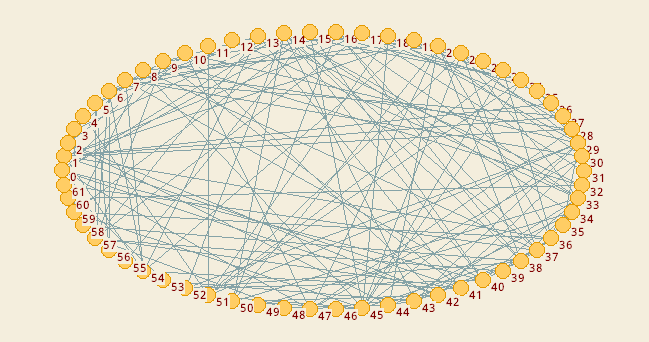
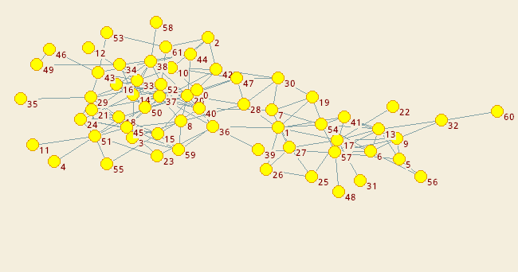
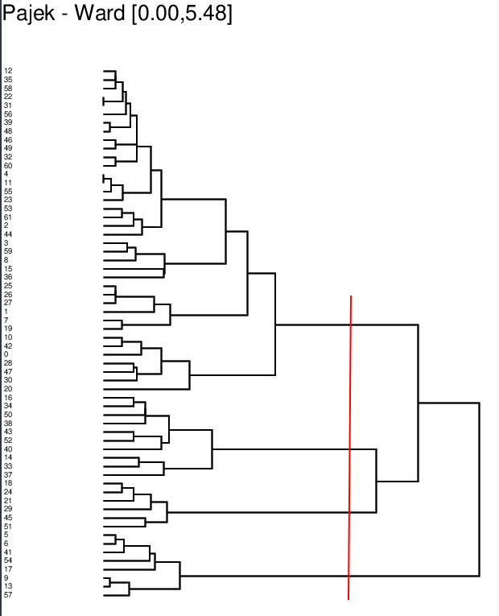
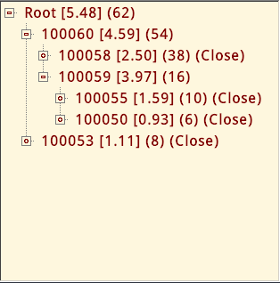
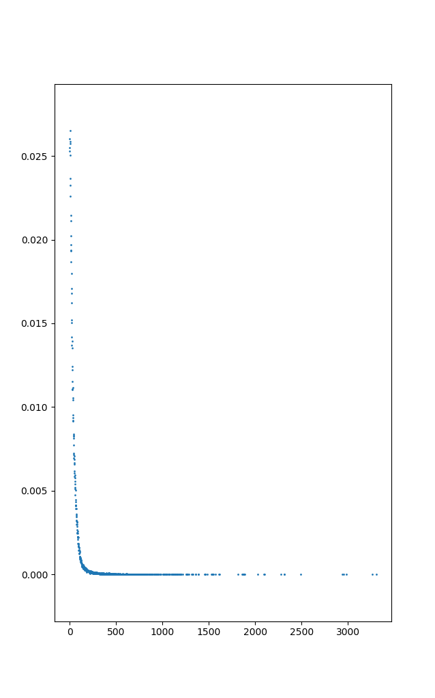

# Sprawozdanie z pierwszego projektu.

## Zadanie 1, zbiór danych nr. 5

### 1.1 - Rzędy i rozmiary
- Rząd sieci: 62
- Rozmiar sieci: 159

Największą składową spójną jest cała wczytana sieć.
- Rząd największej spójnej składowej: 62
- Rozmiar największej spójnej składowej: 159

### 1.2 - Wykreślenie największej składowej spójnej
Graf narysowany domyślną metodą:

Graf narysowany metodą Kamada-Kawai:

Dwa wykresy i trzeba jeszcze komentarz

Po narysowaniu największej składowej spójnej, będącej jednocześnie całą wczytaną siecią, można
zauważyć następujące zjawiska:
- Delfiny w stadzie podzielone są na dwie główne grupy. Do lewej należy około 40 osobników, do
  prawej 22.
- Kilka delfinów lubi żyć w samotności. Występują one na krańcach grafu i mają tylko jedno
  połączenie z grupą. Są to np.: osobniki numer: 35, 11, 4, 48, 31, 60, 20, 58

### 1.3 - Grupowanie metodą Warda z metryką d1
Aby wykonać grupowanie metodą Warda trzeba wybrać: Cluster / Create Complete Cluster,
oraz Operations / Network + Cluster / Dissimilarity / Network based / d1 / All.
W wyniku powyższych czynności, Pajek wygenerował dendrogram w formacie eps.

### 1.4 - Wykreślenie dendrogramu i propozycja cięcia

### 1.5 - Wykreślnie wyodrębnionych grup
Wyodrębnienie podgrup:

Wykreślona sieć z wyodrębnionymi grupami:

## Zadanie 2, zbiór danych nr. 1

### 2.1 - Rzędy i rozmiary
- Rząd sieci: 100386
- Rozmiar sieci: 2194979
- Rząd sieci po usunięciu pętli i duplikatów krawędzi: 100386
- Rozmiar sieci po usunięciu pętli i duplikatów krawędzi: 2094593

### 2.2 - Wyodrębnienie największej składowej spójnej
Największą składową spójną jest cała wczytana sieć.
- Rząd największej składowej spójnej: 100386
- Rozmiar największej składowej spójnej: 2094593

### 2.3 - Aproksymacja średniej długości ścieżki na próbie losowej:
- 100 par wierzchołków: 3.62600

- 1000 par wierzchołków: 3.65780

- 10000 par wierzchołków 3.67514

### 2.4 - Liczba rdzeni:
- O największym możliwym rzędzie równym 89: 1
- O drugim największym możliwym rzędzie równym 88: 1
- O trzecim największy możliwym rzędzie równym 87: 1

### 2.5 - Wykreśl rozkład stopni wierzchołków

### 2.6 - Wyznacz wykładnik rozkładu potęgowego metodą regresji dla dopełnienia
### dystrybuanty rozkładu stopni, dla przedziałów rozlokowanych logarytmicznie

### 2.7 - Wyznacz wykres Hilla
Wykresy Hilla dla:
- k od 2 do 1000
- k od 400 do 500

